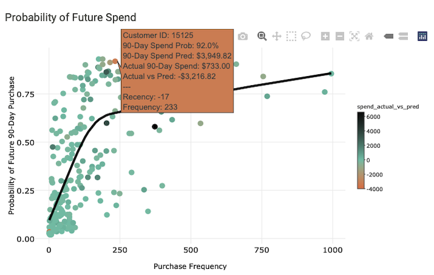
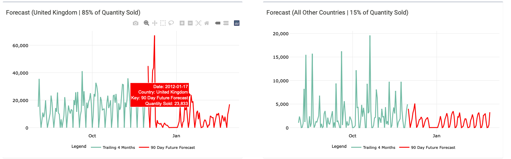

# __Retail Analytics Solution & Shiny Web Application__

================================================================================

 

### __Project Overview__
* __Goal:__ Create a 3 part retail analytics solution for an online retailer. 
* __Data:__ Dataset is the popular online retail dataset from [Kaggle](https://www.kaggle.com/datasets/mashlyn/online-retail-ii-uci).
* __Analysis Approach:__ Customer Lifetime Value, Product Recommendations and Forecasting.
* __Deployment:__ Created a shiny web application with a user friendly interface.
* __Tools/Packages:__

    * [Tidyverse](https://www.tidyverse.org) - For data wrangling.
    * [Tidymodels](https://www.tidymodels.org) - For machine learning.
    * [Coop](https://cran.r-project.org/web/packages/coop/index.html) - 
    For building product recommendation system.
    * [Modeltime](https://business-science.github.io/modeltime/) - 
    For forecasting with machine learning.
    * [Shiny](https://shiny.rstudio.com) - For building web application.

================================================================================

### __Solution Details___

#### __Solution 1: Customer Lifetime Value (CLV)__ 
This solution benefits the marketing team by using machine learning to 
understand/predict the probability of a customer making a purchase
within a certain time frame as well as how much the customer might spend. RFM 
(Recency, Frequency and Monetary) features were extracted and used as predictors.
Additionally, this analysis focuses on a particular cohort of customers, i.e the 
customers with a first purchase date in Q1 2010. This represents the largest 
cohort of customers in terms of first purchase dates. 

 

Fore customer 15125 in the examples above, the model predicted a high probability 
of making a purchase in the next 90 days (92%). However while this customer did 
make a purchase, the amount spent was over $3K less than what the model predicted 
($733 actual vs $3216 predicted). This customer will be a prime candidate to reach 
out to and recommend additional products to purchase (see product recommender tab) to 
try and increase their future spend. In contrast, we can see analysis for customer
17340 below.

 

This customer also had a high probability of making a purchase and did spend $2K higher than
the model predicted ($4759 actual vs $2671 predicted). This customer will be a prime candidate
to further analyze, understand their spending habits, see what products they are
purchasing, and recommend similar products to similar customers with low spend. 

__Caveat -__ The model used to make predictions for the CLV analysis did not involve
hyper-parameter tuning, hence some of the large variances between predicted and
actual spend values. In a real business case, we can improve the performance of a 
prediction model by doing hyper-parameter tuning. 

---

#### __Solution 2: Product Recommendations__
Builds on the CLV Analysis by using Collaborative Filtering to recommend products to 
customers to customers based on what similar customers have purchased in the prior
90 days. For example we see that customer 15125 purchased $3K less than predicted. We can 
recommend new products to this customer based on what similar customers have purchased.

__Caveat -__ This analysis use [user-based collaborative filtering](https://www.geeksforgeeks.org/user-based-collaborative-filtering/), which recommends 
products based on what similar customers have purchased. Meaning that a customer has 
to have made a purchase in the analysis time frame in order to find similarities with
other customers and thus recommend products. In a real business case, there may be
situations where an [item-based collaborative filtering](https://www.geeksforgeeks.org/item-to-item-based-collaborative-filtering/) method is used instead. This method uses relationships between pairs of products to recommend new products to customers. 

---

#### __Solution 3: Sales Forecasting__
This solutions provides a high level forecast of quantity of products sold. For this analysis,
a 90 day forecast horizon was used. Forecast hierarchy was broken out by United Kingdom vs
all other countries. This is due to the fact that the UK accounts for 85% of product
sales (on average). Once again this forecast benefits the marketing, sale and purchasing
teams with planning inventory levels for future sales. 

